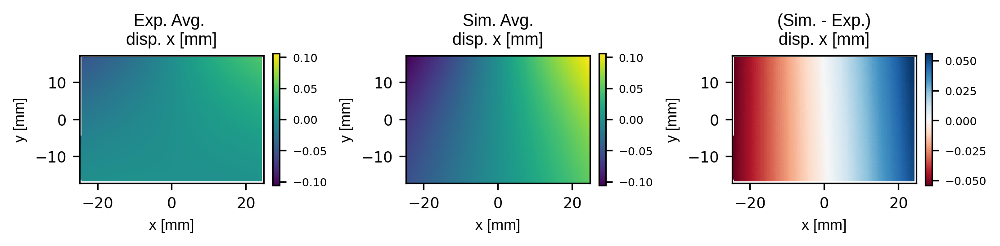
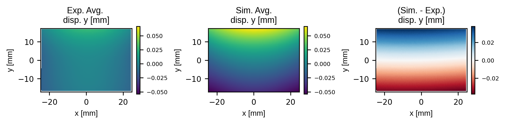
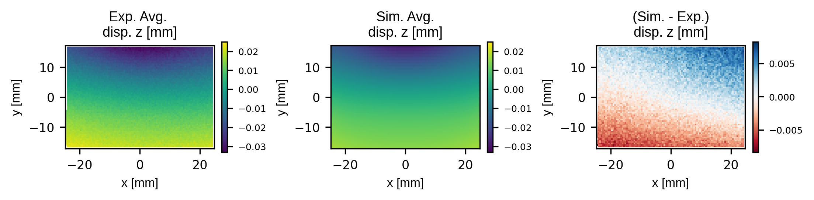
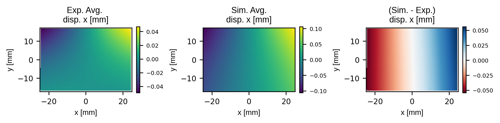
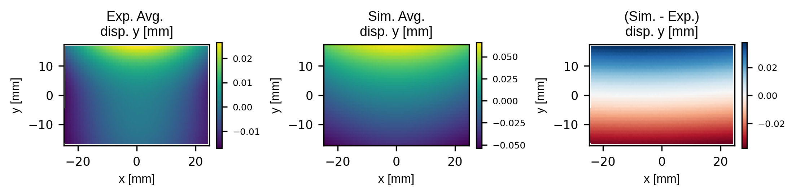
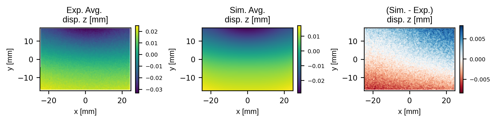
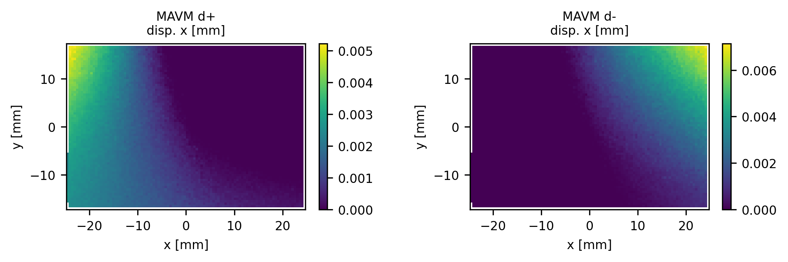
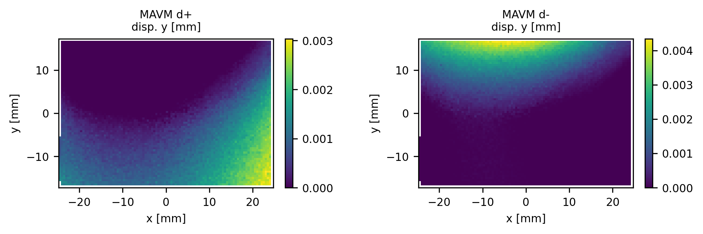
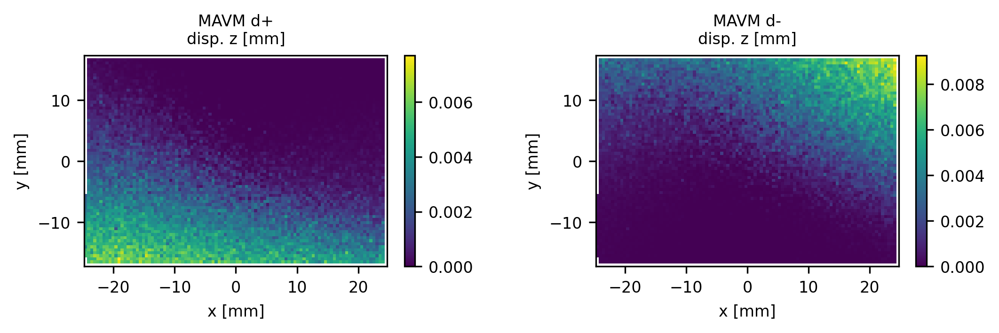

# Report: Full-Field Validation Metrics
Application of the Modified Area Validation Metric (MAVM) to the high heat flux test of the Simple Test Case (STC) on Key Challenge 4 (KC4).

## Coordinate System Transformation
To make the coordinate systems consistent between the experiment and simulation the data for both was transformed to a coordinate system that was centred on the data point cloud. For both cases the mean of the coordinates was taken as dataset coordinate system origin and the principal axes for the point cloud were extracted using singular value decomposition. The eigen vectors from the singular value decomposition and the coordinate system origin where then used to build a transformation matrix which was inverted and multiplied by the coordinates and the displacement field for the simulation and experiment respectively. This transformed the coordinates and fields of the experiment and simulation to a common coordinate system centered about their respective centroids.

Note that for the experimental data using digital image correlation (DIC) the coordinates are not the same at each time step. This is because the surface coordinates are extracted as part of the correlation process which locates each unique pixel subset on the samples surface at each time step. Therefore, each frame of the experimental data was transformed using a unique transformation derived from the point cloud for the given frame.

A rigid body motion correction was also applied to the simulation and experimental displacement data by averaging the displacements for each component and subtracting this average from the full-field data. This allows for the analysis of displacements that contribute to strain without including the effects of rigid body motion Note that this corrections assumes minimal rigid rotation.

## Averaging and Interpolation for Full-Field Comparisons
Analysis of displacement traces for regions experiencing the largest displacement showed that the sample was approximately steady state between frames 300 and 650. Therefore, the experimental data was averaged between these frames to compare to the probabilistic simulation data.

The simulation data was provided as 100 steady state solves for the displacement field with each simulation representing a sample from the input probabilistic distributions. The simulation data was given on square grid of 0.5mm pitch resulting in a total of 7000 points on the sample surface. The experimental data was on an irregular set of coordinates identified at each time step from the digital image correlation process. However, the experimental data was significantly more dense than the simulation data resulting in 47,566 data points per frame. For this reason the experimental data was interpolated onto the lower density simulation grid for full-field comparisons.

Key points:
- Data for the experiment was averaged between frames 300 and 650 for steady state based on analysis of displacement traces for points near the highest displacement.
- The DIC data was significantly more dense than the simulation data so it was interpolated to the simulation grid for full-field comaprisons (using `griddata` from `scipy` with linear interpolation).

## Full-Field Comparison
A comparison of the full-field displacements for each component are shown below. Note that the scale bars for the experiment and simulation have been set to be consistent to allow for a fair comparison. These figures should be used in the KC4 report:

||
|:--:|
|*Comparison of experiment to simulation for the x (horizontal) displacement component.*|

||
|:--:|
|*Comparison of experiment to simulation for the y (vertical) displacement component.*|

||
|:--:|
|*Comparison of experiment to simulation for the z (out of plane) displacement component.*|

The following figures do not lock the colorbar to be consistent between the experiment and the simulation allowing comparison of the shape of the overall fields:

||
|:--:|
|*Comparison of experiment to simulation for the x (horizontal) displacement component.*|

||
|:--:|
|*Comparison of experiment to simulation for the y (vertical) displacement component.*|

||
|:--:|
|*Comparison of experiment to simulation for the z (out of plane) displacement component.*|

Analysis of these figures shows:
- For the x, y and z displacement components the shape of the simulation and experimental fields are similar.
- For the x and y displacement components the simulation over predicts the displacement by a factor of ~2. This could be a result of an incorrect temperature predication or an incorrect thermal expansion coefficient or a combination of both.
- Analysis of the shape of the y displacement fields shows that there is a difference in the distribution which might result from a difference in boundary conditions but this is second order compared to the mismatch in the overall magnitude mentioned previously.

**NOTE:** should we include the standard deviation maps here as well? They would give a better idea if the difference is significant.

## Validation Metric Calculation
The Modified Area Validation Metric (MAVM) was calculated according to this [article](http://asmedigitalcollection.asme.org/verification/article-pdf/8/1/011001/6974199/vvuq_008_01_011001.pdf). The MAVM and cumulative density functions for the x and y displacement components at relevant key points is shown below. For the x displacement the peak is observed on the left and right edges at the top corners of the sample so (x,y)=(24.25,15.75) was selected. For the y displacement the peak occurs at the top center of the sample for (x,y)=(0.25,16.25) was selected.

|=(24.25,15.75)_v2.png)|
|:--:|
|*Comparison of cumulative distribution functions for the x displacement at a point near the maximum displacement (see previous displacement maps).*|

|=(24.25,15.75)_v2.png)|
|:--:|
|*Modified area validation metric for the x component of displacement at a point near the maximum displacement.*|

|=(0.25,15.75)_v2.png)|
|:--:|
|*Comparison of cumulative distribution functions for the y displacement at a point near the maximum displacement (see previous displacement maps).*|

|=(0.25,15.75)_v2.png)|
|:--:|
|*Modified area validation metric for the y component of displacement at a point near the maximum displacement.*|

The MAVM gives two bounds to the simulation result termed d+ and d-. These are taken as the worst case deviation between the experiment and simulation in a signed manner. As the d+ and d- are the worst case deviation they are not a function of probability and yield a scalar value for each point in the displacement maps. Therefore the maps of d+ and d- are shown below for each displacement component.

||
|:--:|
|*Modified area validation metric upper 'd+' and lower 'd-' deviation between the simulation and experiment for the x displacement component.*|

||
|:--:|
|*Modified area validation metric upper 'd+' and lower 'd-' deviation between the simulation and experiment for the y displacement component.*|

||
|:--:|
|*Modified area validation metric upper 'd+' and lower 'd-' deviation between the simulation and experiment for the y displacement component.*|

The shape of the MAVM d+ and d- are symmetric about the centreline of the sample. As the sample undergoes volumetric expansion due to the imposed induction heating this would indicate a difference in either the temperature distribution or the thermal expansion coefficient with the simulation.
